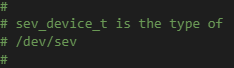
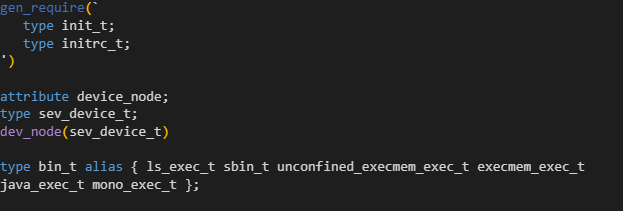
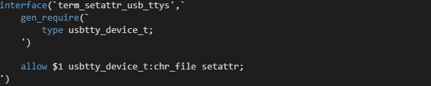
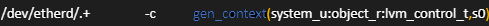
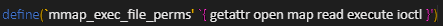

# **SElinuxhelper README**

SElinuxhelper is a VS Code exentsion that allows code completion, intellisense of definitions, and syntax highlighting for various types of SELinux files. 

The following are the supported file types: **.te, .if, .fc, and .spt.**

# **Features**

## <u> Definition Hover and Go-To </u>

To see the definition hovering over a term.
Use Ctrl + Click to open the file location containing the definition
Use F12 while cursor is in a word or it is highlighted to jump to the file location of the definition

## <u> Comment Highlighting </u>

Comments in all files are colored **green**.

Example:

## <u> .te Syntax Highlighting </u>

For .te files, the following are the colors for each file specific blocks of code:

* `gen_require`, `type`, and `alias` are colored **blue.**
* `dev_node` is colored **purple.**
* Parenthesis for `gen_require` and `dev_node` are colored **yellow.**

Example:

## <u> .if Syntax Highlighting </u>

For .if files, the following are the colors for each file specific blocks of code:

* `interface`, `gen_require`, `type`, and `allow` are colored **blue.**

Example:

## <u> .fc Syntax Highlighting </u>

For .fc files, the following are the colors for each file specific blocks of code:

* `gen_context` is colored **blue.**
* Parenthesis for `gen_context` are colored **yellow.**

Example:
 

## <u> .spt Syntax Highlighting </u>

For .spt files, the following are the colors for each file specific blocks of code:

* `define` is colored **blue.**
* Parenthesis for `define` and backticks not surrounding brackets are colored **yellow.**
* Brackets and backticks surrounding those brackets are colored **pink.**

Example:

# Requirements

No additional requirements for this extension.

# Extension Settings

No additional extension settings for this extension.

# Release Notes

## <u> 0.0.2 </u>

Initial prerelease of SeLinuxhelper.

# Credits

Developed by Sophia Boisvert, Easton Anderlik, Pranav Pradeep, Matt McCoy, Trevor Tomer, and Zeal Bhatt.

SELinux Logo used under the Creative Commons ShareAlike 2.5 license. Credit to Máirín Duffy.

Link to License: https://creativecommons.org/licenses/by-sa/2.5/

Link to Artist: https://www.deviantart.com/pookstar/gallery

Link to Selinux page: https://selinuxproject.org/ 

